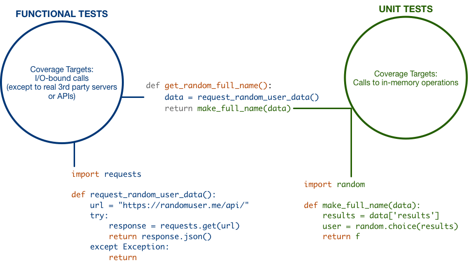

.. _guide:

Step-by-step guide
==================

.. _create service accounts:

1. Create service accounts
--------------------------

We will depend on services are free for open source projects.

Feel free to skip any services in which you already have an account.

Below you can find direct links for account creation pages:

#. `Make a github account <https://github.com/join>`_
#. `Make a PyPi account <https://pypi.org/account/register>`_
#. `Make a Read-The-Docs account  <https://readthedocs.org/accounts/signup/>`_
#. `Make a Travis account <https://travis-ci.org/>`_ (requires a github account)

.. _install virtualenv:

2. Install virtualenv
---------------------

.. code:: bash

   pip install virtualenv

.. seealso:: If you are feeling adventurous, use `pipenv <https://docs.pipenv.org/>`_ a great tool for python development workflow including managing virtualenvs and keeping track of installed packages (Pipfile)

.. _install cookiecutter:

3. Install cookiecutter
-----------------------

To speed-up our productivity we will use `cookiecutter <https://cookiecutter.readthedocs.io/en/latest/>`_.

.. code:: bash

   pip install cookiecutter

4. Create your package with cookiecutter
----------------------------------------

.. warning:: you will need to have `git <https://git-scm.com/downloads>`_ installed for this step.

The template is available on github at `gabrielfalcao/cookiecutter-from-editor-to-pypi <https://github.com/gabrielfalcao/cookiecutter-from-editor-to-pypi>`_

Cookiecutter is smart enough to install directly from github, for that
just run the following command from your ``~/projects`` folder or
whenever you prefer to keep personal projects.

.. code:: bash

   cookiecutter gh:gabrielfalcao/cookiecutter-from-editor-to-pypi

.. important:: **Answer carefully** to the interactive questions. Try
               your best to avoid typos in this step as it might impact
               many files of your newly-created project.

5. Run tests
------------

In your project root, run:

.. code:: bash

   make unit
   make functional
   make docs

6. Create a github repository and push your code
------------------------------------------------

Head to `https://github.com/new <https://github.com/new>`_ and create a repository that matches your pypi package name.

The cookiecutter template already created a git repository for you, so you can simply **go to your project root path and add the git remote ``origin`` as instructed by github.**
